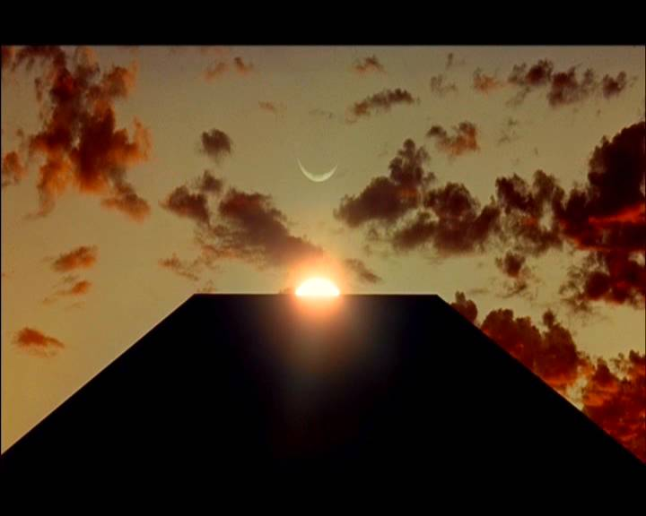

# Documentation

As with all documentation, this is a work in progress. It's not an exhaustive exploration of the source code but more just a walk though the overall idea of what this project is and how it got to its present state. 

* [Development History](./history.md)
* [Basic Concepts](./concepts.md)
* [Low-Level Programming Interface](./interface.md)
* [Libraries](./libraries.md)
* [Trainers](./trainers.md)

## Language

Throughout this documentation, source code comments, development notes, commit messages, etc. I tend to use these terms interchangeably depending on my mood, whims, and then-current-brainstate. I could probably come up with more formal/rigorous definitions but no need to get too far off into the weeds. 
* engine ↔ host ↔ world ↔ game
* bot ↔ wasm ↔ module ↔ guest ↔ player

## Overall Caveats

I was learning WebAssembly tools while I was doing this (in fact, said learning was a big part of the motivation **for** doing this) so it's probably got a bunch of sub-optimal or unrecommended practices. Same goes for a few of the libraries, where I was having to dust off old knowledge. The libraries are not all consistently implemented because some languages make certain things much more convoluted. They should be **roughly** equivalent though. 

So far this whole thing has been a one-person show, and there's a lot of different problem domains (build pipeline, web frontend, WebAssembly ↔ hosted module communication, code generation in five target languages, the AIs of the bots themselves, procedural generation, 2d visualization, game design, etc.), and I am decidedly **not** equally skilled in all of them. So there's probably parts of this that more experienced practitioners will look at like 🤨. The pull requests are [over there](https://github.com/sjml/wasmbots/pulls). 

The organization of the code is a little haphazard, but I try to be meticulous. It grew organically as different aspects of the project revealed themselves, and might benefit from being broken apart into multiple repositories. At the moment, though, everything is still evolving in lockstep and there's benefit to keeping it all together. If this project ends up being something other people care about, I am happy to do that reorganization work. Until then, though, we're livin' that MONOLITHIC REPOSITORY LIFE. 

